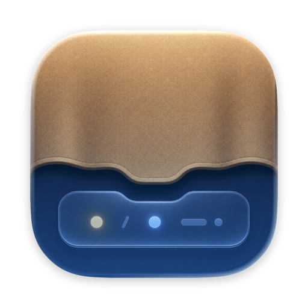

<div align="center">



# Pelmet

**Hide the menu bar icons you rarely need — bring them back with one click or ⌥⌘B.**

*A pelmet is the board above a window that hides the curtain fittings.
This one hides your menu bar clutter, so nothing disappears behind the MacBook notch.*

[](https://github.com/ismatBabirli/pelmet/actions/workflows/ci.yml)
[](https://github.com/ismatBabirli/pelmet/releases/latest)


[](LICENSE)

</div>

> [!NOTE]
> **Status: shipping.** Hide/show works with zero special permissions, and the
> notch-aware Shelf panel and opt-in one-click access have shipped. Show-on-hover
> and profiles are next on the [roadmap](#roadmap).

## Why

On notched MacBooks, macOS silently hides menu bar items that don't fit next to
the camera housing — no overflow indicator, the icons are just *gone*. Pelmet
gives you back control: park rarely-used icons behind a divider and summon them
when you need them. And when icons *still* don't fit, Pelmet is the only tool
that tells you — a small **+3** appears next to its chevron, with tips one
right-click away. No other utility detects this, and Pelmet does it with zero
permissions.

## How it works — no private APIs, no permissions

Pelmet places two items in your menu bar:

```
[hidden icons…]  ╱  [always-visible icons…]  ‹  clock
                 │                           │
             separator                    toggle
```

- Pelmet hides everything to the **left** of the ╱ separator — **⌘-drag** the
  icons you always want visible to its **right**, next to the clock.
- When collapsed, Pelmet inflates the separator's width (bounded at ~4,000 pt —
  macOS caps status-item windows near 5,000 pt), pushing everything left of it
  past the screen edge. Expand and they slide back.
- This is the same battle-tested technique used by Hidden Bar and Dozer. It
  needs **no** Screen Recording or Accessibility permission.
- If the expanded icons don't all fit beside the notch, the toggle shows a
  count (e.g. **› +3**) instead of letting them vanish without a trace.
  Right-click it for ways to make room. Detection uses only public
  window-geometry metadata — nothing that prompts for permissions or lights
  the screen-recording indicator.

## Usage

| Action | How |
|---|---|
| Show/hide managed icons | Click the ‹ / › toggle, or press **⌥⌘B** |
| Keep an icon always visible | ⌘-drag it to the **right** of the ╱ divider |
| See why icons are missing | Hover or right-click the toggle when it shows **+N** |
| Lost the divider? | Right-click the toggle → Reset Divider Position |
| Fit more icons beside the notch | Settings → Make Room… (incl. tighter icon spacing) |
| Settings (auto-rehide, launch at login) | Right-click the toggle → Settings… |
| Quit | Right-click the toggle → Quit Pelmet |

## Install

### Homebrew (recommended)

```bash
brew install --cask ismatBabirli/pelmet/pelmet
```

This taps `ismatBabirli/homebrew-pelmet` and installs the signed, notarized app
into `/Applications`. Upgrade later with `brew upgrade --cask pelmet`.

### Direct download

Download the latest `Pelmet-<version>.dmg` from the
[Releases page](https://github.com/ismatBabirli/pelmet/releases/latest), open it,
and drag **Pelmet** to Applications. Builds are signed and notarized by Apple, so
they launch with no Gatekeeper warning.

Pelmet is menu-bar-only — after launching, look **next to the clock**, not in the
Dock.

## Building from source

Prefer to build it yourself? It takes under a minute.

```bash
git clone https://github.com/ismatBabirli/pelmet.git
cd pelmet
swift run
```

The terminal prints a startup banner, and both the ‹/› toggle and the ╱
divider appear **next to the clock** — always visible, never behind the
notch. Building needs a Swift 6 toolchain (Xcode 16+ or recent Command Line
Tools); the app itself runs on macOS 13+. Launch-at-login is the one feature
that needs a real .app bundle:

```bash
brew install xcodegen
xcodegen generate
open Pelmet.xcodeproj   # then build & run with ⌘R
```

### Troubleshooting

- **Nothing appeared in the menu bar.** Pelmet's toggle and divider are
  seeded right next to the clock, the last spot macOS swallows, so this
  should be rare. If your bar is packed edge to edge, quit another menu bar
  app to free some space, then relaunch Pelmet.
- **A number like +3 sits next to the chevron.** That many icons don't fit
  beside the notch, so macOS is hiding them (it never says so itself).
  Right-click the chevron for tips: ⌘-drag important icons toward the clock,
  hide expendable ones behind ╱, or quit unused menu bar apps.
- **I can't find the ╱ divider.** Right-click the chevron → Reset Divider
  Position brings it back next to the toggle.
- **Is it even running?** `swift run` prints a banner once the app is up, and
  pressing ⌥⌘B flips the chevron between ‹ and ›. No Dock icon or window is
  normal — Pelmet is a menu-bar-only app.
- **It quit when I closed the terminal.** Under `swift run` the app belongs to
  your terminal session; Ctrl-C (or closing the tab) quits it. Build the .app
  bundle above for a standalone install.
- **Don't run two copies at once.** Two instances fight over the same status
  items and saved positions. Quit the first one (right-click the chevron →
  Quit Pelmet, or Ctrl-C in its terminal).

## Roadmap

- [x] **The Shelf** — a blurred, rounded panel below the notch listing the icons macOS hid, opened by clicking the count (or ⌥⌘N). Rows show each item's app icon and name — **never a screen capture**, so no Screen Recording permission and no purple recording dot.
- [x] **One-click access** — an *opt-in* Accessibility toggle that opens hidden items with a single click (and identifies them on macOS 26 Tahoe). Off by default; everything else works without it.
- [ ] Show on hover — reveal when the pointer touches the menu bar
- [ ] Profiles and per-item rules (e.g. "presentation mode")
- [ ] Custom hotkey recorder (replace the hardcoded ⌥⌘B)
- [x] **Notarized releases + Homebrew cask** — a signed, notarized `.dmg` on every tagged release; `brew install --cask ismatBabirli/pelmet/pelmet`
- [x] **Sparkle auto-updates** — in-app update checks (Sparkle 2), EdDSA-signed, with an appcast on GitHub Pages; "Check for Updates…" in the menu and a Software Update toggle in Settings

The full vision and phased plan live in [PROJECT.md](PROJECT.md); release history
is in [CHANGELOG.md](CHANGELOG.md).

## Prior art

Pelmet stands on the shoulders of some excellent open-source projects:

- [Ice](https://github.com/jordanbaird/Ice) (GPL-3.0) — the most advanced open-source option; its "Ice Bar" panel is the behavior reference for our notch panel (GPL — we reference behavior, never code)
- [Hidden Bar](https://github.com/dwarvesf/hidden) (MIT) — origin of the expanding-spacer trick
- [Dozer](https://github.com/Mortennn/Dozer) (MIT)

## Contributing

Bug reports, ideas, and small PRs are very welcome — see
[CONTRIBUTING.md](CONTRIBUTING.md) for a two-minute guide and a map of the
codebase.

## License

[MIT](LICENSE) © 2026 Ismat Babirli
